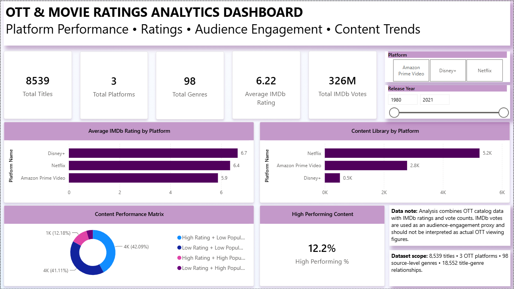
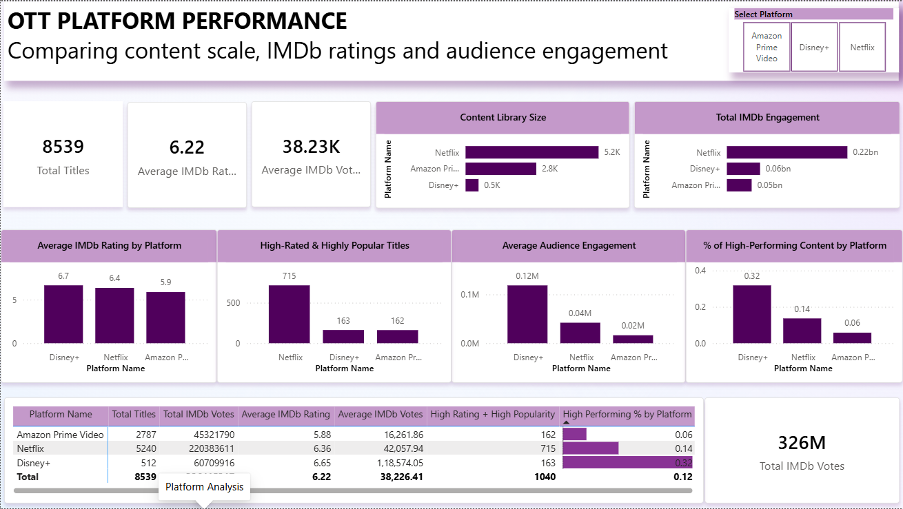
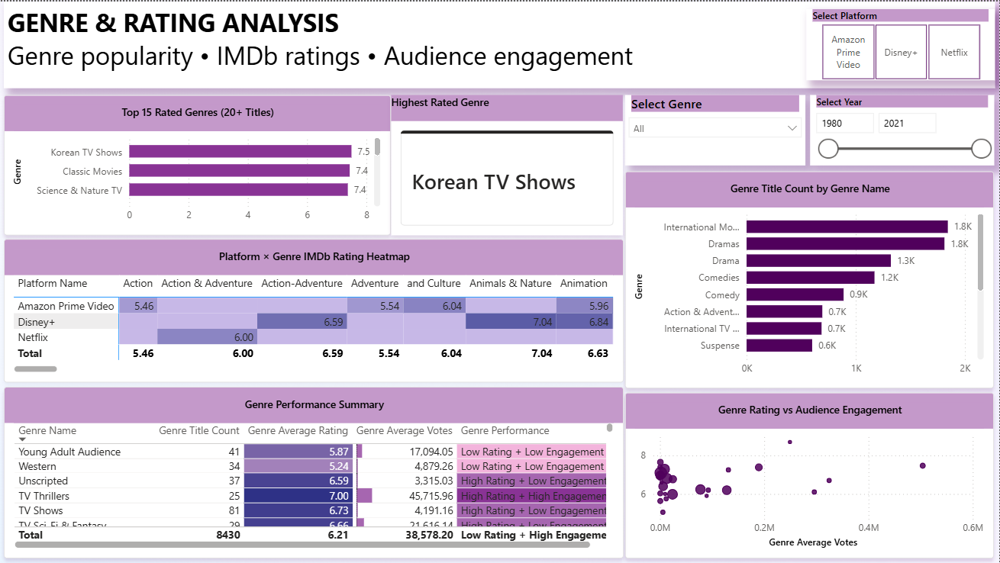
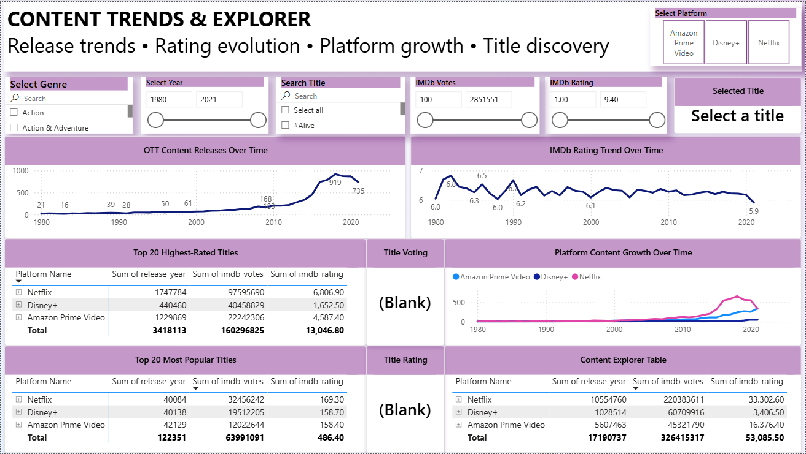

<div align="center">


# 🎬 OTT & Movie Ratings Trend Analysis

### End-to-End Data Analytics & Business Intelligence Project

<p>


</p>

<p>


</p>

**Transforming raw OTT catalog and IMDb data into structured analytics, interactive dashboards, and actionable business insights.**

</div>

---

## 🧭 Table of Contents

- [📌 Executive Summary](#-executive-summary)
- [🎯 Business Problem](#-business-problem)
- [💼 Business Objectives](#-business-objectives)
- [❓ Key Business Questions](#-key-business-questions)
- [📊 Project Metrics](#-project-metrics)
- [🏆 Key Business Insights](#-key-business-insights)
- [💡 Business Recommendations](#-business-recommendations)
- [🛠️ Technology Stack](#️-technology-stack)
- [🔄 End-to-End Workflow](#-end-to-end-workflow)
- [🐍 Data Preparation](#-data-preparation)
- [⭐ IMDb Integration](#-imdb-integration)
- [🗄️ Database Architecture](#️-database-architecture)
- [🧩 Database Normalization](#-database-normalization)
- [🧮 SQL Analytics](#-sql-analytics)
- [📐 DAX Analytics](#-dax-analytics)
- [📈 Power BI Dashboard](#-power-bi-dashboard)
- [🎛️ Dashboard Features](#️-dashboard-features)
- [🔍 Data Quality & Validation](#-data-quality--validation)
- [📁 Project Structure](#-project-structure)
- [⚙️ Installation](#️-installation)
- [🗄️ MySQL Setup](#️-mysql-setup)
- [🔁 Reproducibility](#-reproducibility)
- [⚠️ Data Limitations](#️-data-limitations)
- [🚀 Future Improvements](#-future-improvements)
- [💼 Skills Demonstrated](#-skills-demonstrated)
- [🎯 Why This Project Demonstrates Job-Ready Skills](#-why-this-project-demonstrates-job-ready-skills)
- [📝 Resume-Ready Summary](#-resume-ready-summary)
- [🎤 Interview Talking Points](#-interview-talking-points)
- [👨‍💻 Author](#-author)

---

# 📌 Executive Summary

This end-to-end Business Intelligence project analyzes **8,539 OTT titles across 3 platforms**, using OTT catalog data combined with IMDb ratings and audience vote counts.

The analysis covers **98 source-level genres**, **18,552 title-genre relationships**, and identifies **446 multi-platform titles** after data cleaning, title matching, validation, and normalization.

The solution combines **Python, Pandas, NumPy, MySQL, advanced SQL, DAX, and Power BI** to evaluate platform scale, content quality, audience engagement, genre performance, content trends, and high-performing/under-engaged titles.

The project is designed to answer practical business questions around **catalog strategy, content quality, audience engagement, content discovery, and platform differentiation**.

---

# 🎯 Business Problem

OTT platforms compete across content volume, quality, audience engagement, genre diversity, discovery, and exclusivity.

This project evaluates the competitive position of **Netflix, Disney+, and Amazon Prime Video** by combining catalog-level information with IMDb ratings and vote counts.

The objective is not simply to describe the data, but to transform it into a decision-support framework that highlights:

- 📚 Catalog scale
- ⭐ Content quality
- 👥 Audience engagement
- 🎭 Genre opportunities
- 💎 Under-discovered content
- 🔄 Multi-platform overlap
- 📈 Content trends

> **Important:** IMDb votes are treated as an audience-engagement proxy and are not equivalent to actual OTT streaming views.

---

# 💼 Business Objectives

1. Compare platform content libraries.
2. Compare average IMDb ratings.
3. Analyze audience engagement.
4. Identify high-performing content.
5. Identify hidden-gem opportunities.
6. Analyze genre performance.
7. Analyze release-year trends.
8. Identify multi-platform titles.
9. Build a normalized analytical database.
10. Build an interactive Power BI dashboard.
11. Generate evidence-based business recommendations.

---

# ❓ Key Business Questions

### 🏢 Platform Intelligence

- Which platform has the largest content catalog?
- Which platform has the highest average IMDb rating?
- Which platform has the strongest average audience engagement?
- Which platform has the highest density of high-performing content?

### 🎭 Genre Intelligence

- Which genres dominate the catalog?
- Which genres have the highest average ratings?
- Which genres attract stronger audience engagement?
- How does genre performance vary across platforms?

### 🎬 Content Intelligence

- Which titles have the highest IMDb ratings?
- Which titles have the strongest engagement?
- Which high-rated titles have relatively low engagement?
- Which titles are available across multiple platforms?

### 📈 Trend Intelligence

- How has content availability changed by release year?
- How do platforms differ across release periods?
- How do ratings and engagement vary across content generations?

---

# 📊 Project Metrics

| KPI | Result |
|---|---:|
| 🎬 OTT Platforms | **3** |
| 🎞️ Titles Analyzed | **8,539** |
| 🎭 Source-Level Genres | **98** |
| 🔗 Title-Genre Relationships | **18,552** |
| 🚫 Excluded Titles | **72** |
| 🔄 Multi-Platform Titles | **446** |
| ⭐ Overall IMDb Rating | **6.22** |
| 👥 Average IMDb Votes / Title | **38,226** |

---

# 🏆 Platform Performance

| Platform | Titles | Avg IMDb Rating | Avg IMDb Votes | Total IMDb Votes | High Rating + High Popularity |
|---|---:|---:|---:|---:|---:|
| 🇺🇸 Netflix | **5,240** | **6.36** | **42,058** | **220,383,611** | **715** |
| 🏰 Disney+ | **512** | **6.65** | **118,574** | **60,709,916** | **163** |
| 📦 Amazon Prime Video | **2,787** | **5.88** | **16,262** | **45,321,790** | **162** |

### High-Performance Content Density

| Platform | High Rating + High Popularity | Catalog Size | High-Performance % |
|---|---:|---:|---:|
| 🥇 Disney+ | 163 | 512 | **31.8%** |
| 🥈 Netflix | 715 | 5,240 | **13.6%** |
| 🥉 Amazon Prime Video | 162 | 2,787 | **5.8%** |

---

# 🏆 Key Business Insights

## 1. 🥇 Disney+ Leads in Average Content Quality

**Evidence:** Disney+ recorded the highest average IMDb rating at **6.65**, followed by Netflix at **6.36** and Amazon Prime Video at **5.88**.

### Business Interpretation

Disney+ shows the strongest average content quality in the analyzed dataset.

### Business Implication

Disney+ can be positioned as a platform with strong **quality and engagement efficiency**, while Netflix has a much stronger scale advantage.

---

## 2. 📚 Netflix Dominates Catalog Scale

**Evidence:** Netflix contains **5,240 titles**, compared with **2,787** on Amazon Prime Video and **512** on Disney+.

### Business Interpretation

Netflix has the broadest analyzed catalog.

### Business Implication

Netflix's strongest differentiator in this dataset is **catalog breadth and content availability**.

---

## 3. 👥 Netflix Leads Total IMDb Engagement

**Evidence:** Netflix generated approximately **220.38 million total IMDb votes**, compared with **60.71 million** for Disney+ and **45.32 million** for Amazon Prime Video.

### Business Interpretation

Netflix has the largest aggregate engagement footprint in the dataset.

### Business Implication

Netflix's total engagement advantage is closely associated with its substantially larger catalog.

> **Qualification:** IMDb votes are an engagement proxy and should not be interpreted as streaming hours, viewers, or revenue.

---

## 4. 🔥 Disney+ Has the Highest High-Performance Content Density

**Evidence:** Approximately **31.8%** of Disney+'s analyzed catalog falls into the High Rating + High Popularity category, compared with **13.6%** for Netflix and **5.8%** for Amazon Prime Video.

### Business Interpretation

Disney+ has the highest concentration of content that combines strong ratings with high audience engagement.

### Business Implication

The platform could potentially emphasize its strongest-performing content through curated collections, discovery experiences, and personalized recommendations.

---

## 5. 💎 Hidden-Gem Opportunity

The analysis identified **3,594 titles** classified as **High Rating + Low Popularity**.

### Business Interpretation

These titles have strong audience-rated quality but relatively lower engagement.

### Business Implication

They represent a potential content-discovery opportunity through:

- 🎯 Personalized recommendations
- 🔎 Better search/discovery
- 📢 Targeted promotion
- 🏷️ Curated collections
- 🤖 Recommendation-engine optimization

---

## 6. 🎭 High-Quality Genre Segments

Using a minimum threshold of 20 titles, the highest-rated genres were:

| Rank | Genre | Avg IMDb Rating |
|---:|---|---:|
| 🥇 | Korean TV Shows | **7.50** |
| 🥈 | Classic Movies | **7.44** |
| 🥉 | Science & Nature TV | **7.37** |
| 4 | Biographical | **7.30** |
| 5 | Docuseries | **7.30** |

### Business Interpretation

These categories show strong audience-rated quality.

### Business Implication

They may be useful segments for content curation, recommendation strategies, and further acquisition analysis.

---

## 7. 🔄 Multi-Platform Competition

The project identified **446 multi-platform titles**.

### Business Interpretation

A meaningful portion of analyzed content overlaps across platforms.

### Business Implication

Platform differentiation cannot rely solely on content availability. Quality, exclusivity, discovery, personalization, and audience engagement also matter.

---

## 8. 📈 Overall Content Benchmark

The overall analyzed catalog recorded:

- **6.22** average IMDb rating
- **38,226** average IMDb votes per title

These values provide a baseline for evaluating individual platforms, genres, and titles.

---

# 💡 Business Recommendations

| Observed Result | Recommended Action |
|---|---|
| Disney+ has high-performing content density | Emphasize strong titles through curated collections and personalized discovery |
| Netflix has the largest catalog | Strengthen content discovery and personalization to reduce catalog overload |
| 3,594 titles are high-rated but low-popularity | Build a hidden-gem recommendation/promotion strategy |
| 446 titles overlap across platforms | Focus differentiation on exclusivity, quality, and discovery |
| Several genres show strong average ratings | Evaluate genre-specific acquisition and recommendation strategies |
| IMDb engagement varies significantly by platform | Use engagement as a supporting indicator alongside quality and catalog scale |

> These are **analytical recommendations**, not measured financial outcomes.

---

# 🛠️ Technology Stack

### 🐍 Programming & Analysis


### 🗄️ Database & SQL


### 📊 Business Intelligence


### 🧰 Tools


---

# 🔄 End-to-End Workflow

```text
┌──────────────────────┐
│      RAW DATA        │
└──────────┬───────────┘
           ↓
┌──────────────────────┐
│   DATA CLEANING      │
│ Missing Values       │
│ Duplicates           │
│ Standardization      │
└──────────┬───────────┘
           ↓
┌──────────────────────┐
│         EDA          │
│ Pandas / NumPy       │
│ Statistical Analysis │
└──────────┬───────────┘
           ↓
┌──────────────────────┐
│   IMDb INTEGRATION   │
│ Ratings + Votes      │
└──────────┬───────────┘
           ↓
┌──────────────────────┐
│   TITLE MATCHING     │
│ Normalized Keys      │
│ Fuzzy Matching       │
└──────────┬───────────┘
           ↓
┌──────────────────────┐
│ MULTI-PLATFORM       │
│ ANALYSIS             │
└──────────┬───────────┘
           ↓
┌──────────────────────┐
│       MySQL          │
│ Normalized Database  │
└──────────┬───────────┘
           ↓
┌──────────────────────┐
│    ADVANCED SQL      │
│ CTEs / Window Funcs  │
│ Ranking / Segments   │
└──────────┬───────────┘
           ↓
┌──────────────────────┐
│      DAX MODEL       │
└──────────┬───────────┘
           ↓
┌──────────────────────┐
│      POWER BI        │
│ Interactive Dashboard│
└──────────┬───────────┘
           ↓
┌──────────────────────┐
│  BUSINESS INSIGHTS   │
└──────────────────────┘
```

---

# 🐍 Data Preparation

Python was used for:

- Data ingestion
- Missing-value analysis
- Duplicate detection
- Data-type conversion
- Text standardization
- Unicode normalization
- Title cleaning
- Data validation
- Exploratory Data Analysis

### Key Libraries

```text
Pandas
NumPy
Matplotlib
Seaborn
RapidFuzz
SQLAlchemy
PyMySQL
```

---

# ⭐ IMDb Integration

IMDb data was integrated to enrich the OTT catalog with:

- IMDb ratings
- IMDb vote counts
- Audience-engagement indicators

### Matching Process

```text
Raw Title
   ↓
Text Normalization
   ↓
Whitespace / Unicode Cleaning
   ↓
Matching Key Generation
   ↓
Exact Matching
   ↓
Fuzzy Matching Where Required
   ↓
Validation
   ↓
Matched / Excluded Records
```

Unresolved or problematic records were excluded where necessary to preserve analytical quality.

---

# 🗄️ Database Architecture

```text
                  ┌─────────────────┐
                  │    platforms    │
                  ├─────────────────┤
                  │ platform_id PK  │
                  │ platform_name   │
                  └────────┬────────┘
                           │
                           │
                  ┌────────▼────────┐
                  │      titles     │
                  ├─────────────────┤
                  │ title_id PK     │
                  │ title           │
                  │ release_year    │
                  │ imdb_rating     │
                  │ imdb_votes      │
                  │ platform_id FK  │
                  └────────┬────────┘
                           │
                           │
                  ┌────────▼────────┐
                  │   title_genres  │
                  ├─────────────────┤
                  │ title_id FK     │
                  │ genre_id FK     │
                  └────────┬────────┘
                           │
                           │
                  ┌────────▼────────┐
                  │     genres      │
                  ├─────────────────┤
                  │ genre_id PK     │
                  │ genre_name      │
                  └─────────────────┘
```

The `title_genres` table handles the **many-to-many relationship** between titles and genres.

---

# 🧩 Database Normalization

Normalization was used to:

- Reduce data redundancy
- Improve consistency
- Improve maintainability
- Separate platform, title, and genre entities
- Handle many-to-many title/genre relationships
- Support referential integrity
- Improve analytical flexibility

### Normalized Tables

```text
platforms
titles
genres
title_genres
```

---

# 🧮 SQL Analytics

### SQL Techniques

- `SELECT`
- `WHERE`
- `GROUP BY`
- `HAVING`
- `JOIN`
- `LEFT JOIN`
- `CASE`
- Subqueries
- CTEs
- Window Functions
- `RANK()`
- `DENSE_RANK()`
- `ROW_NUMBER()`
- Aggregations
- Conditional aggregation
- Ranking
- Segmentation

### Analytical Use Cases

- Platform ranking
- Genre ranking
- Top-rated titles
- Engagement analysis
- Rating/popularity segmentation
- Platform × Genre analysis
- Multi-platform analysis
- Business KPI generation

---

# 📐 DAX Analytics

DAX was used to create dynamic Power BI measures for:

- Total Titles
- Average IMDb Rating
- Average IMDb Votes
- Total IMDb Votes
- High-Performing Titles
- High-Performing %
- Genre Volume
- Genre Rating
- Genre Engagement
- Genre Ranking
- Title Ranking
- Filter-aware analysis

### DAX Concepts

```text
CALCULATE()
FILTER()
DIVIDE()
RANKX()
SELECTEDVALUE()
ALL()
ALLEXCEPT()
REMOVEFILTERS()
```

---

# 📈 Power BI Dashboard

## 📊 Page 1 — Executive Overview



### Focus

- Executive KPIs
- Platform comparison
- Overall rating
- Audience engagement
- Content performance

---

## 📈 Page 2 — Platform Analysis



### Focus

- Platform catalog size
- Average IMDb rating
- Audience engagement
- High-performing content
- Platform comparison
- Top-rated titles

---

## 🎭 Page 3 — Genre & Rating Analysis



### Focus

- Top genres
- Top-rated genres
- Genre engagement
- Rating vs engagement scatter plot
- Platform × Genre heatmap
- Genre performance table

---

## 🔎 Page 4 — Trends & Content Explorer



### Focus

- Release-year trends
- IMDb rating trends
- Platform trends
- Top-rated titles
- Content exploration
- Interactive filtering

---

# 🎛️ Dashboard Features

- 📌 KPI Cards
- 🔎 Interactive Slicers
- 🔄 Reset Filters
- 🖱️ Cross-Filtering
- 📑 Page Navigation
- 🏆 Dynamic Rankings
- 💬 Tooltips
- 🔥 Heatmaps
- 📊 Scatter Plots
- 📈 Trend Analysis
- 🎭 Genre Analysis
- 🔍 Content Explorer
- 🎨 Conditional Formatting

---

# 🔍 Data Quality & Validation

Validation included:

- Duplicate checks
- Missing-value checks
- Data-type validation
- Title matching validation
- Unicode normalization
- Genre relationship validation
- Referential integrity
- Record-count reconciliation
- Platform consistency
- SQL-to-Power BI reconciliation

### Final Data Validation Snapshot

```text
Titles                         8,539
Title-Genre Relationships     18,552
Source-Level Genres               98
Multi-Platform Titles             446
Excluded Titles                    72
```

---

# 📁 Project Structure

```text
OTT-Movie-Ratings-Analysis/
│
├── 📁 data/
│   ├── 📁 raw/
│   └── 📁 processed/
│
├── 📁 notebooks/
│   ├── 01_data_cleaning.ipynb
│   ├── 02_exploratory_data_analysis.ipynb
│   ├── 03_imdb_integration.ipynb
│   ├── 04_multiplatform_analysis.ipynb
│   └── 05_data_quality_checks.ipynb
│
├── 📁 sql/
│   ├── 01_database_setup.sql
│   ├── 02_table_creation.sql
│   ├── 03_data_loading.sql
│   ├── 04_basic_analytics.sql
│   ├── 05_advanced_analytics.sql
│   ├── 06_normalization.sql
│   └── 07_business_insights.sql
│
├── 📁 powerbi/
│   └── OTT_Movie_Ratings_Analysis.pbix
│
├── 📁 screenshots/
│   ├── 01_executive_overview.png
│   ├── 02_platform_analysis.png
│   ├── 03_genre_rating_analysis.png
│   └── 04_trends_content_explorer.png
│
├── 📁 docs/
│   └── business_insights.md
│
├── .gitignore
├── requirements.txt
└── README.md
```

---

# ⚙️ Installation

```bash
git clone https://github.com/kdivyash/OTT-Movie-Ratings-Analysis.git

cd OTT-Movie-Ratings-Analysis
```

### Create Virtual Environment

#### Windows

```bash
python -m venv venv
venv\Scripts\activate
```

#### macOS / Linux

```bash
python3 -m venv venv
source venv/bin/activate
```

### Install Dependencies

```bash
pip install -r requirements.txt
```

---

# 🗄️ MySQL Setup

Create the database:

```sql
CREATE DATABASE ott_movie_analysis;
```

Execute SQL scripts in this order:

```text
01_database_setup.sql
        ↓
02_table_creation.sql
        ↓
03_data_loading.sql
        ↓
04_basic_analytics.sql
        ↓
05_advanced_analytics.sql
        ↓
06_normalization.sql
        ↓
07_business_insights.sql
```

> 🔐 **Security:** Never commit MySQL passwords, API keys, `.env` files, or database credentials to GitHub.

---

# 🔁 Reproducibility

1. Clone the repository.
2. Install Python dependencies.
3. Prepare the raw datasets.
4. Run the analysis notebooks.
5. Create the MySQL database.
6. Execute the SQL scripts.
7. Open the Power BI report.
8. Configure your local MySQL connection.
9. Refresh the Power BI model.
10. Explore the interactive dashboard.

---

# ⚠️ Data Limitations

- IMDb votes are used only as an audience-engagement proxy.
- IMDb votes do not represent OTT streaming views.
- IMDb ratings are not an objective measure of overall content quality.
- Catalog availability represents the scope of the analyzed datasets.
- Genre labels may contain semantically similar source categories.
- Title matching methodology can introduce false positives or false negatives.
- The dataset should not be interpreted as a real-time OTT catalog.

---

# 🚀 Future Improvements

### 🤖 Machine Learning

- IMDb rating prediction
- Popularity prediction
- Content recommendation system
- Automated genre classification

### 📈 Forecasting

- Content release forecasting
- Rating trend forecasting
- Genre demand forecasting

### ☁️ Data Engineering

- Automated ETL
- Cloud database deployment
- API-based data ingestion
- Scheduled data refresh
- Data pipeline orchestration

### 📊 Business Intelligence

- Power BI Service deployment
- Automated refresh
- Row-level security
- Executive reporting automation

---

# 💼 Skills Demonstrated

| Category | Skills |
|---|---|
| 🐍 Python | Pandas, NumPy, EDA, Data Cleaning |
| 🗄️ SQL | Joins, CTEs, Window Functions, Ranking |
| 🧩 Database | MySQL, Normalization, Relational Modeling |
| 📊 BI | Power BI, Dashboard Design, Interactivity |
| 📐 DAX | Measures, Ranking, Segmentation |
| 🔍 Data Quality | Validation, Matching, Reconciliation |
| 📈 Analytics | Platform, Genre, Trend & Engagement Analysis |
| 🧠 Business Analysis | KPI Development, Insights, Recommendations |
| 🧰 Tools | Jupyter, Git, GitHub |

<div align="center">

# 👨‍💻 Author

## **K DIVYASH**

### Data Analyst | BI Analyst

**Python • SQL • MySQL • Power BI • DAX • Data Visualization**

<br>

<a href="https://github.com/kdivyash">

</a>

<a href="https://www.linkedin.com/in/k-divyash">

</a>

<br><br>

⭐ If you found this project useful, consider giving the repository a star!

</div>

---

<div align="center">

### 🚀 From Raw Data to Business Intelligence

**Python → SQL → MySQL → DAX → Power BI → Business Insights**


</div>
